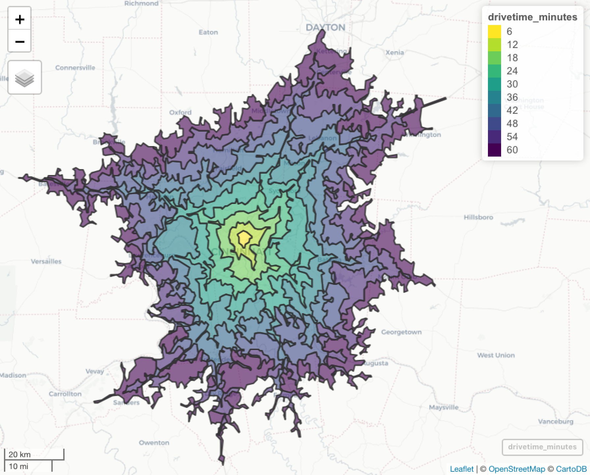

# degauss/drivetime

> DeGAUSS container that calculates driving distance to care center

## Geomarker Data

### Drive Time Isochrones (`drive_time`)

This container uses isochrones to assign drive time to care center for each input address.  Drive time isochrones are concentric polygons, in which each point inside a polygon has the same drive time to the care center. Below is an example of drive time isochrones around Cincinnati Children's Hospital Medical Center.



For each care center, drive times are assigned in 6-minute intervals.  Locations farther than 1 hour away will be assigned a drive time of "> 60".

Drive time isochrones were obtained from [openroute service](https://maps.openrouteservice.org/reach?n1=38.393339&n2=-95.339355&n3=5&b=0&i=0&j1=30&j2=15&k1=en-US&k2=km).

### Distance (`distance`)

This container also calculates "as the crow flies" distance (meters) from care center for each address. The distance does not take into account driving routes, but rather provides an overall metric for how far a participant lives from their care center.

## Using

DeGAUSS arguments specific to this container:

- `file_name`: name of a CSV file in the current working directory with columns named `lat` and `lon`
- `site`: abbreviation for care center for which you would like to obtain drive time and distance; must be from the list below

| **Name** |  **Abbreviation** |
|--------------------|-------------------|
Children's Hospital of Philadelphia | `chop` 
Riley Hospital for Children, Indiana University | `riley`
Seattle Children's Hospital | `seattle`
Children's Mercy Hospital | `mercy`
Emory University | `emory`
Johns Hopkins University | `jhu`
Cleveland Clinic | `cc`
Levine Children's | `levine`
St. Louis Children's Hospital | `stl`
Oregon Health and Science University | `ohsu`
University of Michigan Health System | `umich`
Children's Hospital of Alabama | `al`
Cincinnati Children's Hospital Medical Center | `cchmc`
Nationwide Children's Hospital | `nat`
University of California, Los Angeles | `ucla`
Boston Children's Hospital | `bch`
Medical College of Wisconsin | `mcw`
St. Jude's Children's Hospital | `stj`
Martha Eliot Health Center | `mehc`
Ann & Lurie Children's / Northwestern | `nwu`
Lurie Children's Center in Northbrook | `lccn`
Lurie Children's Center in Lincoln Park | `lcclp`
Lurie Children's Center in Uptown | `lccu`
Dr. Lio's and Dr. Aggarwal's Clinics | `lac`
Recruited from Eczema Expo 2018 | `expo`
University of California San Francisco Benioff Children's Hospital | `ucsf`
Nicklaus Children's Hospital |	`nicklaus`
Medical University of South Carolina Children's Hospital	| `musc`
Children's National Medical Center	| `cnmc`
Children's Hospital of Pittsburgh of UPMC	| `upmc`
Methodist LeBonheur Children's Hospital	| `methodist`
Texas Children's Hospital	| `texas`
Arkansas Children's Hospital	| `arkansas`
Primary Children's Medical Center	| `primary`
Children's Healthcare of Atlanta	| `atlanta`
Children's Medical Center of Dallas	| `dallas`
Lucile Packard Children's Hospital Stanford	| `packard`
Toronto Hospital for Sick Children	| `toronto`
Cook Children's Medical Center	| `cook`
Children's Hospital & Medical Center - Omaha	| `omaha`
Children's Hospital Colorado	| `colorado`
Arnold Palmer Hospital for Children	| `palmer`
Children's Hospital & Clinics of Minnesota	| `minn`
University of Virginia Hospital	| `uva`
Joe Dimaggio Children's Hospital	| `dimaggio`
Cohen Children's Medical Center of New York at Northwell Health	| `cohen`
Dell Children's Medical Center of Central Texas	| `dell`
A.I. duPont Hospital for Children	| `dupont`
Rainbow Babies and Children's Hospital	| `rainbow`
UNC Hospitals Children's Specialty Clinic	| `unc`
Barbara Bush Children's Hospital at Maine Medical	| `maine`

Example calls (that will work with example file included in repository):

**MacOS**

```
docker run --rm -v "$PWD":/tmp degauss/drivetime:0.7 my_address_file_geocoded.csv cchmc
```

**Microsoft Windows**

```
docker run --rm -v "%cd%":/tmp degauss/drivetime:0.7 my_address_file_geocoded.csv cchmc
```

In the above example call, replace `my_address_file_geocoded.csv` with the name of your geocoded csv file and `cchmc` with the abbreviation for the care center to be used for drive time and distance calculations.

Some progress messages will be printed and when complete, the program will save the output as the same name as the input file name, but with `drivetime`, the care center abbreviation, and container version number appended, e.g. `my_address_file_geocoded_drivetime_v0.7_cchmc.csv`

## DeGAUSS Details

For detailed documentation on DeGAUSS, including general usage and installation, please see the [DeGAUSS](https://degauss.org) homepage.

This software is part of DeGAUSS and uses its same [license](https://github.com/cole-brokamp/DeGAUSS/blob/master/LICENSE.txt).
